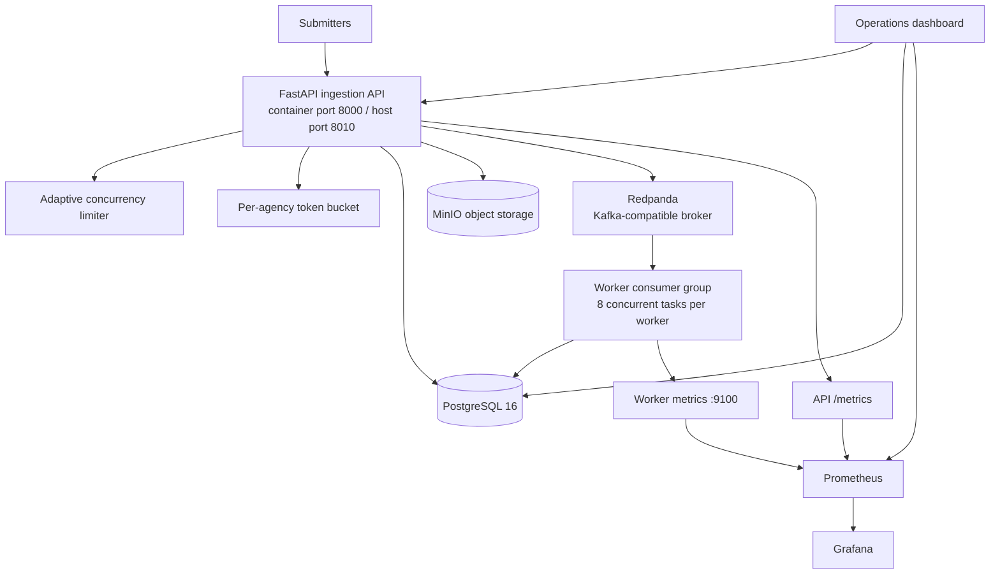

# AegisIngest System Design

## 1. Purpose and Scope

AegisIngest is a containerized, asynchronous ingestion pipeline for cybersecurity audit reports. The current implementation separates request admission, durable metadata, object storage, broker delivery, worker processing, and operational telemetry.

The design target is a burst of 5,000 submissions over 30 seconds. This is a capacity target used to configure the system and load-test tools; it is not a measured production result. The repository contains unit and integration-style tests for the admission, idempotency, partitioning, storage, analyzer, and dashboard classification behavior.

## 2. Runtime Architecture



Compose defines two networks:

- `aegis-frontend-net` exposes the API, dashboard, Prometheus, and Grafana to the host.
- `aegis-backend-net` is internal and connects the API, worker, broker, PostgreSQL, MinIO, dashboard, and Prometheus.

The worker metrics port is configured as `9100` inside the worker container and is not published directly by Compose. Prometheus scrapes the configured service endpoints in `monitoring/prometheus/prometheus.yml`.

## 3. Admission and Ingestion Contract

`POST /api/v1/ingest` accepts JSON, multipart form data, or a raw body. JSON and multipart requests may provide `agency_id`, `audit_type`, `report_year`, `auditor_org`, and `idempotency_key`. Multipart requests may also provide a `file` field.

The API processes a request in this order:

1. Acquire an adaptive concurrency slot.
2. Parse the request and construct document bytes.
3. Apply the per-agency token bucket.
4. Reject payloads larger than 25 MiB with `413`.
5. Save the bytes through SHA-256 content-addressed storage.
6. Create or retrieve the durable PostgreSQL document record.
7. Publish the event to `audit-reports-ingest` with an explicit partition.
8. Return the job identifier and relative status URL.

Response behavior:

| Condition | Response |
| --- | --- |
| New document accepted | `202 Accepted` |
| Existing idempotency key, or the same checksum when no key is supplied | `200 OK` with `DUPLICATE_ACCEPTED` |
| Adaptive limiter saturated | `429` with `Retry-After` |
| Agency bucket exhausted | `429` with `Retry-After` |
| Payload exceeds 25 MiB | `413` |
| Unhandled exception | Global handler returns `429` with `Retry-After: 1` |

The global exception handler is a defensive overload response. It should be treated as an operational safeguard, not as a substitute for observing and fixing unexpected exceptions.

## 4. Capacity Configuration

The default API settings in `api/src/config.py` are:

| Setting | Default | Meaning |
| --- | ---: | --- |
| `BURST_VOLUME` | 5,000 | Target burst size used by the configuration and tooling |
| `BURST_WINDOW_SECONDS` | 30 | Target burst window |
| `TARGET_P95_LATENCY_SECONDS` | 0.150 | Target API p95 latency |
| `MAX_CONCURRENT_REQUESTS` | 250 | Initial hard concurrency ceiling |
| `ADAPTIVE_MIN_LIMIT` | 25 | Adaptive limiter lower bound |
| `ADAPTIVE_MAX_LIMIT` | 500 | Adaptive limiter upper bound |
| `ADAPTIVE_RTT_TARGET_MS` | 100 | RTT threshold used by the adaptive limiter |
| `RATE_LIMIT_AGENCY_BURST` | 100 | Initial tokens per agency |
| `RATE_LIMIT_AGENCY_RATE` | 20/s | Agency token refill rate |
| `KAFKA_NUM_PARTITIONS` | 16 | Ingest topic partition count |
| `MAX_PAYLOAD_BYTES` | 25 MiB | Maximum request document size |

The target-rate derivation is:

$$
\lambda_{mean} = \frac{5000}{30} = 166.67\ \text{requests/second}
$$

The API configuration also records a peak coefficient of 2.0. Applying it to the target mean rate gives 333.33 requests/second. At the 150 ms target latency, Little's Law gives 50 target in-flight requests at that peak rate. The configured initial ceiling of 250 is a 5x safety factor over that calculation. These are planning assumptions, not measured guarantees.

## 5. Partitioning and Ordering

The producer uses `agency_id` as the Kafka key and explicitly selects the partition:

$$
\text{partition} = |\operatorname{MurmurHash3}(\text{agency\_id})| \bmod 16
$$

If the optional `mmh3` dependency is unavailable, the implementation falls back to deterministic CRC32. The tests verify that the same agency maps consistently and that a set of agencies covers the configured partition range.

The same agency is routed consistently to one partition, which supports ordered consumption for that agency under the active partition mapping. This is not a global FIFO guarantee: different agencies can share a partition, and changing the partition count can remap keys.

The main topic is `audit-reports-ingest`. `audit-reports-dlq` is configured in API and worker settings, but the current consumer code does not document a separate DLQ publishing path as part of the normal processing flow; failures are retried and ultimately marked failed in PostgreSQL.

## 6. Persistence and Idempotency

PostgreSQL is the durable source of truth when infrastructure is available. The schema contains:

- `documents`: idempotency key, agency sequence, object key, checksum, broker metadata, lifecycle status, and retry data.
- `processing_results`: one final result per document, protected by a unique document foreign key.
- `processing_events`: chronological API and worker lifecycle events.
- `worker_status`: worker registration, heartbeat, resource fields, and processing counters.
- `load_test_runs`: dashboard performance-test configuration and results.

MinIO stores remote document objects in the `audit-documents` bucket. The API also uses the mounted `data/storage` directory for local content-addressed storage and temporary staging.

When PostgreSQL is unavailable, the API has deliberately non-durable in-memory caches used by tests and fallback execution. Those caches do not provide persistence across process restarts and must not be treated as a production durability mode.

## 7. Worker Processing

Workers consume `audit-reports-ingest` using the `aegis-audit-processors` group with manual offset commit, earliest offset reset, and up to 50 records per poll. Each worker limits active processing to 8 tasks.

The current `MinimalProcessingHandler`:

1. Skips a document that already has a persisted result.
2. Marks the document `PROCESSING` and records an event.
3. Waits for the configured `PROCESSING_DELAY_SECONDS` value, 0.05 seconds by default.
4. Persists a minimal `COMPLETED` result and updates the document.
5. Retries failures up to the configured maximum of 3 attempts, then marks the document `FAILED`.

`worker/src/analyzer.py` contains the cybersecurity benchmark analyzer and is covered by unit tests. It is not currently invoked by the minimal Kafka processing handler, so analyzer scores should not be described as part of the live worker result contract without a corresponding code change.

## 8. Observability and Operations

The API exposes:

- `GET /healthz` and `GET /livez` for API, broker, database, and object-storage state.
- `GET /metrics` for API Prometheus metrics.
- `GET /api/v1/stats` for limiter state and configured capacity.
- `GET /api/v1/console` for a read-only operational snapshot.
- `GET /api/v1/status/{job_id}` for document status.

The dashboard aggregates API, PostgreSQL, and Prometheus data through `/api/telemetry` and `/api/console`. It also supports uploads, generated sample reports, direct bursts, and asynchronous performance-test runs.

Prometheus and Grafana are provisioned by Compose. Grafana uses the dashboard files under `monitoring/grafana/dashboards` and anonymous administrator access in the local deployment.

## 9. Deployment Boundaries

The stack has no runtime dependency on Redis or an external cloud service. It does depend on the container images used by Compose and on the dashboard's current Google Fonts references unless those images/assets are made available in an offline environment. Therefore, the architecture is locally deployable, but a strict air-gapped deployment still requires an image and frontend-asset supply process.

Start the stack with `./start.sh`, `.\start.ps1`, or `docker compose up -d --build`. Scale workers with:

```bash
docker compose up --scale worker=4 -d
```

## 10. Verification References

- [API configuration](../api/src/config.py)
- [Worker configuration](../worker/src/config.py)
- [API entry point](../api/src/main.py)
- [Worker processor](../worker/src/processor.py)
- [Database schema](../database/init.sql)
- [Compose deployment](../docker-compose.yml)
- [Test suite](../tests)
