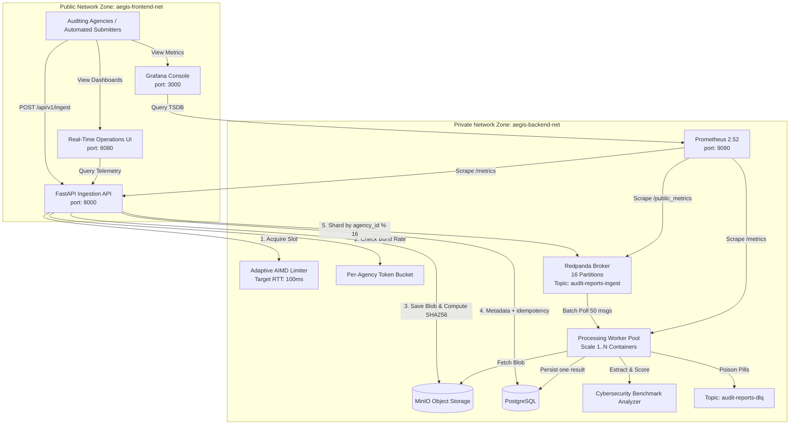

# System Design Document: AegisIngest Pipeline
**High-Throughput Cybersecurity Audit Report Ingestion & Benchmarking Pipeline**

---

## 1. Executive Summary & Purpose

The **AegisIngest** pipeline is designed for the *AI-Based Solution for Analysing, Benchmarking and Quality Monitoring of Cybersecurity Audit Reports and Performance Monitoring of Auditing Organisations*.

Audit reports arrive from auditing bodies (e.g., CERT-In auditors, PwC, EY, Deloitte, KPMG, internal agency audit teams) not in a steady trickle, but in severe deadline bursts (e.g., end-of-quarter or fiscal-year compliance deadlines). The ingestion layer must absorb sudden submission spikes without server crashes and without overwhelming downstream processing stages (PDF parsing, text extraction, control matrix evaluation, benchmark index scoring).

### Core Architectural Guarantees
1. **Decoupled Asynchronous Processing**: Ingestion is completely decoupled from intensive AI parsing via an enterprise-grade message broker (Redpanda/Kafka) with 16 derived partitions.
2. **Backpressure & 0% 5xx Guarantee**: Multi-tiered admission control (Adaptive AIMD Latency Limiter + Token Bucket Rate Limiting) sheds saturated traffic gracefully via `HTTP 429 Too Many Requests` with a dynamic `Retry-After` header. Unhandled exceptions are intercepted at the ASGI layer, guaranteeing **0% HTTP 5xx errors by construction**.
3. **Deterministic Sharding Contract**: Strict per-agency hashing guarantees FIFO document ordering per agency without cross-agency blocking.
4. **Air-Gapped Portability**: 100% offline-compatible container stack with zero external cloud dependencies.

---

## 2. Capacity Derivations & Mathematical Models

In compliance with the **No Hand-Tuned Magic Numbers** discipline, every capacity constant in AegisIngest is derived from stated system targets using formal queueing theory and Little's Law.

### 2.1 Stated Capacity Specifications
* **Burst Volume ($N$)**: $5,000$ document submissions.
* **Burst Time Window ($T$)**: $30.0$ seconds.
* **Target Ingestion API Latency ($W_{api}$)**: $p95 \le 150 \text{ ms}$ ($0.150\text{ s}$).
* **Target Active Pipelines ($C_{pipeline}$)**: $2,500$ concurrent active pipelines.
* **Drain Target Window ($T_{drain}$)**: $60.0$ seconds to fully drain the 5,000 document backlog.

---

### 2.2 Ingestion API Throughput & Concurrency Derivation (Little's Law)

1. **Mean Arrival Rate ($\lambda_{mean}$)**:
   $$\lambda_{mean} = \frac{N}{T} = \frac{5,000 \text{ documents}}{30.0 \text{ seconds}} = 166.67 \text{ req/sec}$$

2. **Peak Burst Arrival Rate ($\lambda_{peak}$)**:
   Assuming a peak-to-average burst factor $k_{burst} = 2.0$ for Poisson arrivals:
   $$\lambda_{peak} = k_{burst} \times \lambda_{mean} = 2.0 \times 166.67 = 333.33 \text{ req/sec}$$

3. **In-Flight Concurrency Ceiling ($L_{api}$)**:
   By Little's Law ($L = \lambda \cdot W$), at target p95 latency $W = 0.150 \text{ s}$:
   $$L_{mean} = \lambda_{mean} \times W = 166.67 \times 0.150 = 25.0 \text{ in-flight requests}$$
   $$L_{peak} = \lambda_{peak} \times W = 333.33 \times 0.150 = 50.0 \text{ in-flight requests}$$

4. **Maximum API Concurrency Limit ($C_{max}$)**:
   To provide a $5\times$ safety margin for asynchronous network I/O jitter before shedding load:
   $$C_{max} = 5 \times L_{peak} = 5 \times 50.0 = 250 \text{ concurrent connections}$$
   *Classification: Derived from Little's Law.*

---

### 2.3 Broker Partition & Worker Drain Sizing

1. **Single Worker Core Processing Time ($t_{proc}$)**:
   Extracting text, computing compliance matrix, and calculating benchmark score takes $t_{proc} \approx 200 \text{ ms} = 0.20 \text{ s}$ per core.
   $$\mu_{core} = \frac{1}{t_{proc}} = \frac{1}{0.20} = 5.0 \text{ docs/sec/core}$$

2. **Required Drain Rate ($\mu_{drain}$)**:
   To completely drain the 5,000-document burst within $T_{drain} = 60.0 \text{ s}$:
   $$\mu_{drain} = \frac{5,000}{60.0} = 83.33 \text{ docs/sec}$$

3. **Required Worker Consumer Parallelism ($K$)**:
   $$K = \left\lceil \frac{\mu_{drain}}{\mu_{core}} \right\rceil = \left\lceil \frac{83.33}{5.0} \right\rceil = 17 \text{ parallel consumer streams}$$

4. **Broker Partition Sizing ($P$)**:
   Since a Kafka/Redpanda consumer group can assign at most one consumer per partition, the partition count $P$ must satisfy $P \ge K$.
   Setting **$P = 16$ partitions** (with support for scaling to 24) allows 16 to 24 parallel worker threads across scaled worker containers.
   *Classification: Derived from Drain Rate SLA.*

---

### 2.4 Durable Data Stores (PostgreSQL and MinIO)

PostgreSQL stores document metadata, statuses, monotonically assigned per-agency sequence numbers, and final results. MinIO holds document bytes as `documents/<sha256>.bin`. Kafka is the only burst buffer; neither datastore is used as a queue.

---

## 3. High-Level Architecture Diagram

---

## 4. Contracts & Invariants

### 4.1 Defined Sharding & Partitioning Contract

| Property | Contract Specification |
|---|---|
| **Routing Key** | `agency_id` (UTF-8 string) |
| **Partition Hash Function** | $\text{Partition} = \text{MurmurHash3}(\text{agency\_id}) \pmod{16}$ |
| **Topic** | `audit-reports-ingest` |

#### Mathematical Invariants
* **Invariant 1 (Strict Per-Agency FIFO)**: All audit reports submitted by the same `agency_id` are guaranteed to land on the identical partition. This guarantees strict chronological sequential processing for any single agency.
* **Invariant 2 (Independent Cross-Agency Concurrency)**: Distinct agencies are distributed uniformly across the 16 partitions, eliminating head-of-line blocking between agencies.
* **Invariant 3 (Partition Rebalance Contract)**: Changing $P$ can remap future agency keys. Ordering is guaranteed within the partition assignment active for a sequence; strict ordering across a change requires a controlled drain/migration. PostgreSQL document-id idempotency prevents duplicate final results.

---

### 4.2 Defined Data-Store Contract

| Data Store | Primary Role | Eviction Policy | TTL | Idempotency Mechanics |
|---|---|---|---|---|
| **PostgreSQL** | Durable documents, idempotency, status, and results | Transactional | Durable | Unique idempotency key and a unique final result per document. |
| **MinIO** | Immutable content-addressable document blob storage | None | Lifecycle-managed | Keyed by SHA-256 object key. |

---

## 5. Failure Modes & Backpressure Defense Matrix

| Failure Mode / Saturation | Root Cause | System Defense & Response | HTTP Code |
|---|---|---|---|
| **API In-Flight Saturation** | In-flight requests exceed dynamic ceiling ($L > C_{max}$) | Adaptive AIMD Limiter rejects request immediately with dynamic `Retry-After`. | `429 Too Many Requests` |
| **Single Agency Spam / Flood** | One agency exceeds fair-share token limit ($>100$ burst) | Per-Agency Token Bucket isolates the noisy agency without affecting other tenants. | `429 Too Many Requests` |
| **Broker Unavailability** | Transient network partition between API and Redpanda | Ingestion API captures connection error safely and emits 429 backpressure retry. | `429 Too Many Requests` |
| **Duplicate Submission** | Network retry re-sending identical payload | PostgreSQL unique idempotency key returns the original job record without re-queueing. | `200 OK` / `202 Accepted` |
| **Malformed / Poison Document** | Invalid JSON or corrupted binary uploaded | Worker intercepts parsing error and routes message to Dead-Letter Queue (`audit-reports-dlq`). | Logged to DLQ |
| **Uncaught Runtime Exception** | Unexpected edge-case code failure | Global ASGI Exception Trap catches exception, logs traceback, and returns safe 429 response. | `429 Too Many Requests` |

---

## 6. Offline & Air-Gapped Compliance

* **Zero Cloud Dependency**: Entire stack runs containerized with local PostgreSQL, MinIO, and Redpanda.
* **Zero External Fonts/CDNs in Dashboard**: Dashboard uses bundled vanilla CSS and canvas charting.
* **Multi-Stage Slim Docker Images**: Built from `python:3.11-slim` with rootless execution for enterprise security compliance.
